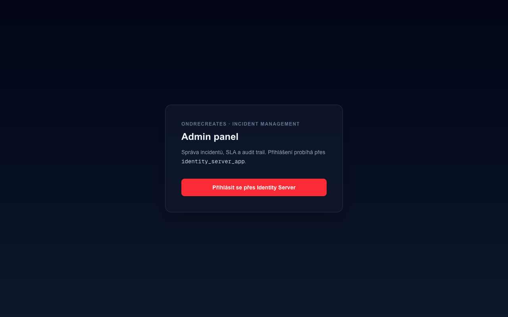
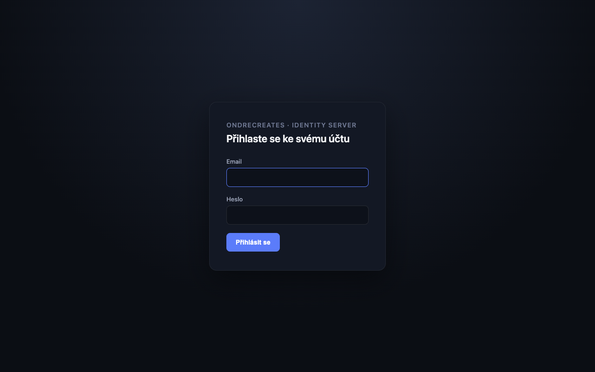
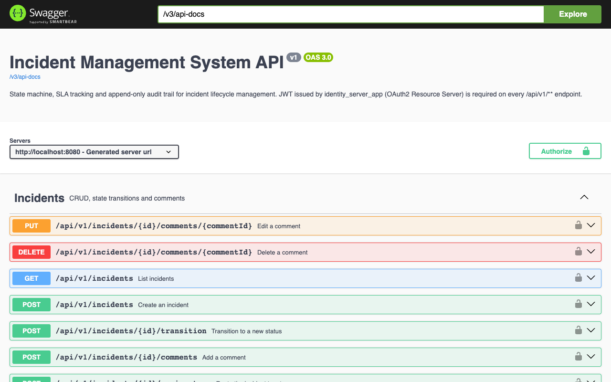

# Incident Management System

*[English version](README.en.md)*

Backend + admin panel pro správu incidentů: explicitní state machine, konfigurovatelné
SLA sledování, eskalace, dashboard analytika a append-only audit trail. Třetí projekt
v portfoliu — po `identity_server_app` (auth) a `notification_center_app` (async
doručování) — demonstruje doménu **stavové byznys logiky a návrhu workflow**.

Není to klon PagerDuty a feature parity nebyl cíl. Cílem bylo navrhnout a obhájit state
machine s reálnými byznys pravidly (SLA, eskalace, audit trail) pod tlakem otázek na
pohovoru — ne postavit co nejvíc featur.

## Screenshoty

| Admin panel -- landing | Login (`identity_server_app`) | API (Swagger UI) |
| --- | --- | --- |
|  |  |  |

Obrazovky za přihlášením (seznam incidentů, detail, dashboard) vyžadují OAuth2/PKCE login
přes `identity_server_app` s vynuceným MFA, takže je nejde automatizovaně vyfotit bez
druhého faktoru u seed účtu. Viz krok 2 ve [Verifikačních krocích](#verifikační-kroky-e2e)
níž pro manuální ověření celého flow -- screenshoty do `docs/screenshots/` může kdokoliv
s přístupem k druhému faktoru doplnit stejným postupem.

## Co appka umí

- **Incidenty**: CRUD, explicitní state machine o 6 stavech (`Created → Assigned →
  Investigating → Mitigated → Resolved → Closed`, s reopen větví zpátky do
  `Investigating`), append-only timeline/audit trail ke každému incidentu.
- **Filtrování a hledání**: podle statusu, severity, přiřazeného uživatele/týmu,
  case-insensitive fulltextové hledání v titulku/popisu, stránkování.
- **Konfigurovatelné SLA**: politika (SLA okno + near-breach práh) nastavitelná per
  severity na `/sla-policies`, bez redeploye. Scheduled job hlídá breach/near-breach a
  sklápí příznaky na incidentu.
- **Eskalace** (near-breach i breach): e-mail přes `notification_center_app` a živý
  in-app toast přes WebSocket (STOMP) do admin panelu -- oba kanály best-effort, appka
  nikdy nespadne kvůli nedostupné notifikační službě.
- **Týmy**: CRUD, správa členů, routing incidentu na tým jako nezávislý audit fakt vedle
  individuálního přiřazení.
- **Komentáře**: přidání, editace a mazání (soft-delete -- timeline zůstává, obsah se jen
  skryje) -- jen původní autor.
- **Hromadné akce**: bulk přechod stavu a bulk přiřazení nad vybranými incidenty najednou,
  per-item výsledek (dávka s mixem platných/neplatných operací aplikuje ty platné, ne
  všechno nebo nic).
- **CSV export** incidentů respektující aktuálně nastavené filtry.
- **Postmortem**: create/update formulář, jen pro incidenty v terminálním stavu
  (Resolved/Closed).
- **Dashboard**: KPI (aktivní/critical/breached count), průměrná doba řešení, SLA
  compliance %, graf počtu vytvořených incidentů za posledních 14 dní.
- **Auth**: OAuth2 Authorization Code + PKCE přes `identity_server_app`, JWT validace
  proti JWKS, MFA vynucené pro všechny uživatele.
- **CI/CD**: GitHub Actions na každý push/PR (backend testy proti reálné MySQL,
  frontend type-check + build), Docker Compose deployment.

## Architektura

```
                        ┌─────────────────────┐
  browser ─────────────▶│  admin-panel (:3001) │
                        │  Next.js, OAuth2/PKCE│
                        └──────────┬───────────┘
                                   │ Bearer token
                                   ▼
                        ┌─────────────────────┐        ┌──────────────────────┐
                        │   app (:8080)         │───────▶│ identity_server_app   │
                        │  Spring Boot 3        │  JWKS  │  (:9000, samostatný   │
                        │  OAuth2 Resource Srv  │        │  docker-compose stack)│
                        └──────────┬────────────┘        └──────────────────────┘
                                   │            │
                                   ▼            └────────▶┌──────────────────────┐
                        ┌─────────────────────┐  X-API-Key│ notification_center   │
                        │   mysql (:3308)       │           │  _app (:8081,          │
                        └─────────────────────┘           │  samostatný stack)     │
                                                            └──────────────────────┘
```

- **State machine**: ruční `Map<Status, Set<Status>>` v `IncidentTransitionService`, ne
  knihovna — 6 stavů, v podstatě lineární s jednou reopen větví neospravedlňuje Spring
  State Machine.
- **Auth**: tahle služba nevydává ani nespravuje credentials. JWT vydává
  `identity_server_app`, validuje se tady proti jeho JWKS endpointu. `sub` claim nese
  uživatelův email (identity_server_app nedává do tokenu žádné numerické ID) — proto je
  externí user ID napříč touto službou `VARCHAR`, ne `BIGINT`.
- **Audit trail**: `incident_timeline` je append-only. Žádný UPDATE/DELETE proti té
  tabulce nikdy.
- **Eskalace**: scheduled job volá `notification_center_app` REST API (X-API-Key), nikdy
  neimplementuje vlastní doručování e-mailů. Best-effort — nedostupný notification
  service escalation job nespadne, jen se to zaloguje.
- **Admin panel**: server-first Next.js (Server Components + Server Actions) — access
  token žije jen v httpOnly cookii na serveru, do prohlížeče se nikdy nedostane.

## Rychlý start

### Docker Compose (celý stack)

Vyžaduje běžící `identity_server_app` (JWKS + login flow). `notification_center_app` je
potřeba jen pro eskalaci — bez něj appka funguje, eskalační e-maily se jen nedoručí
(zalogováno jako warning).

```bash
# 1. identity_server_app (v jeho vlastním adresáři)
cd ../Identity_server_app && docker compose up -d

# 2. tenhle stack (MySQL + backend + admin panel)
cd ../Incident_management_system_app && docker compose up -d --build
```

Po naběhnutí:

- Admin panel: http://localhost:3001
- API: http://localhost:8080/api/v1
- Swagger UI: http://localhost:8080/swagger-ui.html
- Identity server login: http://localhost:9000/login (seed účet
  `admin@identity-server.dev` / `admin123`)

### Eskalace (volitelné, pro lokální ověření)

`notification_center_app` defaultně taky běží na `:8080` jako tenhle backend — při
lokálním běhu obou mimo Docker spusť jeden z nich na jiném portu. Klienta a API klíč
vytvoříš přes jeho admin API:

```bash
curl -X POST http://localhost:8081/api/v1/admin/clients \
  -H "X-Admin-Key: dev-admin-key-change-me" \
  -H "Content-Type: application/json" \
  -d '{"name":"incident-management-app"}'
```

Zkopíruj vrácený `apiKey` do `NOTIFICATION_API_KEY` (viz `application.yml` /
docker-compose env).

Pro živé in-app WebSocket notifikace v admin panelu (toast při near-breach/breach
eskalaci) navíc nastav `NOTIFICATION_WS_URL` (browser-facing adresa
`notification_center_app`, např. `ws://localhost:8081/ws`) a `NOTIFICATION_WS_CLIENT_ID`
(id klienta vráceného výše -- musí odpovídat tomu, čí `apiKey` je v `NOTIFICATION_API_KEY`).
Bez nich se funkce jen tiše vypne, stejná "optional infrastructure" pozice jako eskalační
e-mail. Pozor: jde o build args (viz `admin-panel/Dockerfile`), takže po změně je potřeba
`docker compose up -d --build admin-panel`, ne jen restart kontejneru.

### Bez Dockeru (lokální vývoj)

```bash
docker compose up -d mysql          # jen databáze
mvn spring-boot:run                 # backend na :8080

cd admin-panel
cp .env.example .env.local          # a doplň hodnoty
npm install
npm run dev -- -p 3001              # admin panel na :3001
```

### Testy

```bash
mvn test                            # 72 testů: unit (state machine matrix) + integrační (proti reálné MySQL)
cd admin-panel && npm run build     # type-check + build všech routes
```

CI (`.github/workflows/ci.yml`) spouští obojí na každý push/PR do `main` -- backend
proti MySQL service kontejneru, admin panel type-check + build.

## Verifikační kroky (E2E)

1. `docker compose up -d --build` v tomhle adresáři, s běžícím `identity_server_app`
   vedle — celý stack naběhne bez chyby (`docker ps` ukáže tři healthy kontejnery).
2. Přihlas se přes admin panel (http://localhost:3001) přes login flow
   `identity_server_app` (první přihlášení vyžaduje nastavení TOTP — MFA je vynucené pro
   všechny uživatele, ne jen volitelné).
3. Vytvoř incident, projdi ho celým happy path: Created → Assigned → Investigating →
   Mitigated → Resolved → Closed.
4. Zkus nevalidní přechod (např. Created → Closed přímo) přes `/swagger-ui.html` nebo
   curl — ověř 409 s tělem `{"error":"INVALID_TRANSITION","allowed":[...]}`.
5. Vytvoř incident se severity `CRITICAL`, over jeho `sla_deadline` v databázi do
   minulosti (`UPDATE incident SET sla_deadline = NOW() - INTERVAL 1 HOUR WHERE id = ?`),
   počkej do 60s na scheduled job, ověř že `sla_breached` sklopí na `true` a projeví se na
   dashboardu.
6. Přidej komentář, ověř že se objeví v timeline feedu na detailu incidentu.
7. Založ tým na `/teams` v admin panelu, routuj na něj incident z jeho detailu, ověř
   `TEAM_ASSIGNMENT` timeline záznam.
8. S běžícím `notification_center_app` a nastaveným `NOTIFICATION_API_KEY`: over
   `near_breach_at` incidentu do minulosti, počkej na escalation job, ověř doručený e-mail
   v Mailhogu (http://localhost:8025).
9. Přesuň incident do `Resolved`, vyplň postmortem formulář na jeho detailu, ověř že se
   uloží a jde upravit. Zkus vytvořit postmortem pro incident, co ještě neni terminální —
   ověř 409 `POSTMORTEM_NOT_ALLOWED`.
10. Na `/sla-policies` uprav SLA politiku pro `LOW` (např. na 30 minut), ověř že už
    existující incidenty s touhle severitou mají deadline nezměněný, ale nově vytvořený
    incident dostane nový, kratší deadline.
11. Na `/dashboard` ověř, že se zobrazí průměrná doba řešení, SLA compliance % a graf
    vytvořených incidentů za posledních 14 dní.
12. Na `/incidents` vyhledej podle klíčového slova z titulku/popisu (pole "Hledat") —
    ověř že se seznam filtruje.
13. Uprav vlastní komentář (inline edit), pak ho smaž — ověř že v timeline zůstane
    záznam, jen s textem `[komentář smazán]`.
14. Na `/incidents` zaškrtni dva incidenty, spusť hromadný přechod stavu na kombinaci kde
    jeden z nich přechod nedovoluje — ověř že se aplikuje jen ten platný a druhý nahlásí
    chybu ve stejné odpovědi.
15. Na `/incidents` klikni "Export CSV" (případně s nastaveným filtrem) — ověř že se
    stáhne `incidents.csv` odpovídající aktuálnímu filtru.
16. S nastaveným `NOTIFICATION_WS_URL`/`NOTIFICATION_WS_CLIENT_ID`: vyvolej near-breach
    nebo breach eskalaci (viz krok 5/8) a ověř, že se v admin panelu objeví toast
    notifikace bez nutnosti obnovit stránku.
17. `curl -i http://localhost:8080/api/v1/incidents` bez `Authorization` hlavičky — ověř
    401.
18. `mvn test` — všechny testy zelené.

## Zajímavá návrhová rozhodnutí

- **Assignment jako samostatný audit fakt.** `assigned_user_id` se mění přes
  `IncidentAssignmentService`, ne uvnitř `IncidentTransitionService` — přiřazení a
  stavový přechod jsou nezávislé koncepty (potvrzuje to i state machine: reassignment se
  modeluje jako přechod zpátky do `ASSIGNED`, nezávisle na tom, kdo byl přiřazený
  předtím), takže mají vlastní `EventType.ASSIGNMENT` timeline záznam. Stejný vzor pro
  tým (`IncidentTeamAssignmentService`, `EventType.TEAM_ASSIGNMENT`) — routing na tým a
  přiřazení jednotlivci jsou nezávislé.
- **`open-in-view: false` + `LEFT JOIN FETCH`.** Timeline dotaz explicitně fetchuje
  přidruženou `IncidentComment`, aby `TimelineEntryResponse` mohla ukázat obsah
  komentáře bez `LazyInitializationException` mimo request-scoped transakci. Stejný vzor
  pro `Team.members`.
- **User ID jako email, ne BIGINT.** Zjištěno až při napojování na `identity_server_app`
  (Fáze 1D) — JWT `sub` claim nese email, ne numerické `AppUser.id`. Viz `V2__user_id_as_email.sql`.
- **`near_breach_at` je vlastní sloupec, ne odvozený za běhu.** Počítá se jednou při
  vytvoření (80 % SLA okna), stejně jako `sla_deadline` — konzistentní vzor, jednoduchý
  index-friendly dotaz místo per-severity `CASE` výrazu v SQL.
- **Eskalace má dva nezávislé `*_notified` flagy**, ne jeden sdílený se
  `SlaBreachJob`. Rozpojuje escalation job od přesného timingu, kdy `SlaBreachJob` flipne
  `sla_breached` — a nechává Fáze 1E job netknutý.
- **`NotificationClient` je rozhraní**, ne konkrétní třída. Mockito inline mock maker
  padá na JDK 25 (pozorováno na tomhle stroji) — testy nahrazují implementaci fake
  třídou místo mockování, což je navíc čistší přístup nezávisle na tomhle JDK detailu.
- **SLA politika se čte při vytvoření, nikdy nepřepočítává.** `sla_deadline` a
  `near_breach_at` se počítají jednou z `SlaPolicy` v momentě vytvoření incidentu a pak
  žijou nezávisle na tabulce -- změna politiky nemá zpětný efekt na už otevřené
  incidenty. Stejný princip jako předtím u hardcoded hodnot, jen zdroj pravdy se přesunul
  z kódu do DB.
- **`resolved_at` se čistí při reopenu.** `IncidentTransitionService` ho nastaví při
  přechodu do `RESOLVED` a vynuluje při přechodu zpátky do `INVESTIGATING` -- průměrná
  doba řešení tak vždycky odráží poslední vyřešení, ne první pokus, co byl nakonec
  reopenutý.
- **Hledání je `LIKE`, ne MySQL `FULLTEXT MATCH...AGAINST`.** Na objemu dat, který
  tenhle portfolio projekt kdy bude mít, by relevance ranking nic nepřidal a stálo by to
  composability s ostatními `Specification` filtry (native `MATCH` by vyžadovalo
  samostatnou cestu mimo Criteria API).
- **`BulkOperationService` je záměrně samostatný bean**, ne metoda uvnitř
  `IncidentService`. Bulk endpointy jsou per-item, ne all-or-nothing -- jedna neplatná
  položka v dávce nesmí rollbacknout ty úspěšné vedle ní. Volání `IncidentService`'s
  `@Transactional` metod z JINÉHO beanu prochází reálným Spring proxy a dostane vlastní
  transakci za položku; volání ze stejné třídy (self-invokace) by proxy obešlo a celá
  dávka by sdílela jednu transakci.
- **In-app notifikace se posílají přímo z prohlížeče do `notification_center_app`**, ne
  přes tenhle backend jako proxy. STOMP topic (`/topic/notifications/{clientId}`) je
  scoped na `notification_center_app`'s client id, ne na konkrétního uživatele -- ověřeno
  naživo (viz `NotificationToasts`), ne odhadem ze zdrojáků.
- **`ApiException` je společný abstraktní základ** pro doménové výjimky mapované na
  `{error, message}` JSON (`IncidentNotFoundException`, `CommentAuthorMismatchException`
  atd.) -- `GlobalExceptionHandler` má jeden `@ExceptionHandler` místo jednoho na typ.
  `InvalidTransitionException` zůstává mimo, protože její tělo má navíc
  `from`/`attempted`/`allowed`.

## Známá omezení (záměrná, ne přehlédnutá)

- **Tvrdá runtime závislost na `identity_server_app`.** Bez JWKS endpointu appka
  nenaběhne do funkčního stavu (mutující endpointy vrátí 401). Přijatelné pro portfolio
  demo; v reálném multi-team prostředí by to chtělo token cache / circuit breaking.
- **Eskalace je best-effort, ne garantované doručení.** `notification_center_app`
  nedostupný → escalation job zaloguje warning a pokračuje, incident zůstane bez
  notifikace do dalšího pollu. Přijatelné pro portfolio demo (viz `NotificationClient`).
- **Žádný automatizovaný E2E test s reálně vydaným tokenem.** MFA je vynucené pro
  všechny přihlášení do `identity_server_app`, takže plný authorization_code+PKCE flow
  nejde skriptovat bez lidského TOTP kroku — pokryto manuálním ověřením výše, integrační
  testy backendu používají mockovaný JWT (`SecurityMockMvcRequestPostProcessors`).

## Roadmapa — co dál

Fáze 1, 2 a 3 a čtyři "quick-win" vylepšení (editace/mazání komentářů, hromadné akce, CSV
export, in-app WebSocket notifikace) hotové (viz `ROADMAP.md`, lokální negitovaný
plánovací dokument, pro plný rozpad). Zbývá jen to, co bylo od začátku vědomě mimo scope
portfolio projektu: multi-tenancy, veřejná zákaznická status stránka, webhooky pro
integraci třetích stran.
